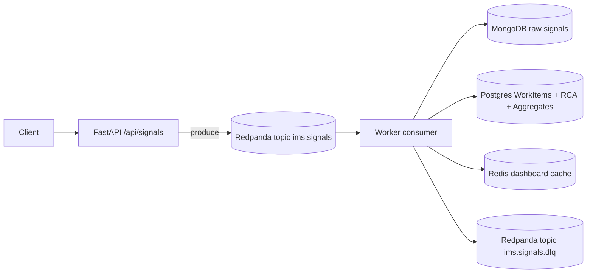

# Incident Management System (IMS) — Backend Engine + Infra

This repository implements the **backend engine + infrastructure** for the IMS assignment:
async ingestion → broker → worker → polyglot persistence, with a transactional incident workflow, mandatory RCA before closure, and MTTR calculation.

## Architecture



## Backpressure handling (why the system doesn’t crash)

- **Thin ingestion API**: `/api/signals` validates + rate-limits and only enqueues to Kafka; it does not write to Postgres/Mongo in the request path.
- **Broker buffering**: when persistence is slow/unavailable, Kafka/Redpanda absorbs the burst; ingestion remains stable.
- **Worker retries + DLQ**: worker retries DB writes; malformed events and repeated failures are sent to `ims.signals.dlq` for audit and replay/debug.

### Demo: pause Postgres while ingesting

```bash
./scripts/demo_backpressure.sh
```

## Quickstart (Backend)

```bash
cp .env.example .env  # optional
docker compose up --build -d
```

## Verification Checklist (curl)

### 1) Health

```bash
curl -sS http://localhost:8000/api/health
```

### 1b) Metrics snapshot

```bash
curl -sS http://localhost:8000/api/metrics | jq
```

### 2) Generate incidents (simulator)

```bash
./scripts/simulate_outage.py
```

### 3) List incidents (sorted by severity)

```bash
curl -sS http://localhost:8000/api/incidents | jq
```

Pick an `INCIDENT_ID` from the output.

### 4) Incident detail (signals + RCA state)

```bash
curl -sS http://localhost:8000/api/incidents/$INCIDENT_ID | jq
```

### 5) Workflow transitions

OPEN → INVESTIGATING:
```bash
curl -sS -X POST http://localhost:8000/api/incidents/$INCIDENT_ID/transition \
  -H 'content-type: application/json' \
  -d '{"to_state":"INVESTIGATING"}' | jq
```

INVESTIGATING → RESOLVED:
```bash
curl -sS -X POST http://localhost:8000/api/incidents/$INCIDENT_ID/transition \
  -H 'content-type: application/json' \
  -d '{"to_state":"RESOLVED"}' | jq
```

RESOLVED → CLOSED (should fail without RCA):
```bash
curl -sS -X POST http://localhost:8000/api/incidents/$INCIDENT_ID/transition \
  -H 'content-type: application/json' \
  -d '{"to_state":"CLOSED"}' | jq
```

### 6) Submit RCA (computes MTTR), then close

Submit RCA:
```bash
curl -sS -X POST http://localhost:8000/api/incidents/$INCIDENT_ID/rca \
  -H 'content-type: application/json' \
  -d '{
    "start_time":"2026-04-30T12:00:00Z",
    "end_time":"2026-04-30T12:10:00Z",
    "root_cause_category":"RDBMS",
    "fix_applied":"Restarted primary and restored connectivity",
    "prevention_steps":"Add synthetic checks + automatic failover"
  }' | jq
```

Close (should succeed now):
```bash
curl -sS -X POST http://localhost:8000/api/incidents/$INCIDENT_ID/transition \
  -H 'content-type: application/json' \
  -d '{"to_state":"CLOSED"}' | jq
```

## Notes
- If you don’t have `jq`, you can remove `| jq` from the commands.
