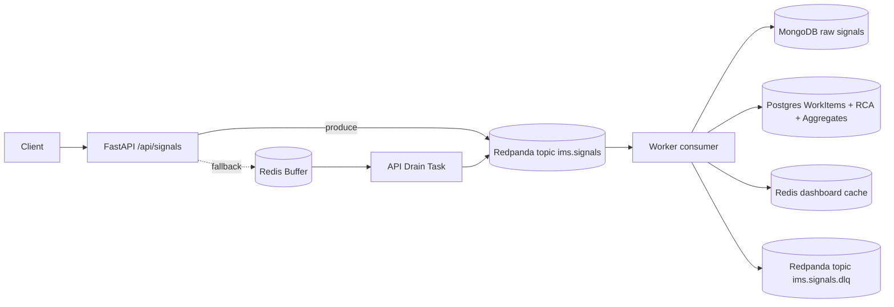

# Incident Management System (IMS) — Backend Engine + Infra

This repository implements the **backend engine + infrastructure** for the IMS assignment:
async ingestion → broker → worker → polyglot persistence, with a transactional incident workflow, mandatory RCA before closure, and MTTR calculation.

## Data Flow & Architecture



## Contracts & Failure Behavior (Production Grade)

The system is designed to survive partial outages without data loss or duplication:

1. **Ingestion Degradation**: If Kafka becomes unreachable, the `/api/signals` endpoint implements exponential backoff retries. If those fail, it falls back to a Redis memory buffer to ensure 202 Accepted requests are never dropped. An async drain task automatically pushes these to Kafka upon recovery.
2. **Idempotency**: All signals require an `event_id`. Duplicate ingestion attempts are rejected at the MongoDB layer via a strict unique index.
3. **Single Active Incident**: The PostgreSQL schema enforces a partial unique constraint (`UNIQUE (component_id) WHERE state != 'CLOSED'`). Concurrent workers cannot create duplicate incidents for the same component burst.
4. **MTTR Contract**: Mean Time To Recovery is strictly computed as the RCA submission timestamp minus the timestamp of the *first* signal in the incident burst, removing manual tampering of end times.
5. **RCA Completeness**: DB-level `CheckConstraint` enforces that all RCA fields are non-empty and logically ordered before closure.
6. **Audit Completeness**: All mutations (state changes, notes, RCA submissions, SLA breaches) trigger an immutable `IncidentEvent` row in the same transaction.

### Demo Scripts

We provide scripts to simulate production disasters:
- `./scripts/kill_kafka.sh`: Observe the API degrade gracefully to the Redis buffer without dropping requests.
- `./scripts/kill_worker.sh`: Observe Kafka buffering the load.
- `./scripts/burst_test.sh`: Flood the system to prove concurrency and debounce logic holds up.
- `./scripts/replay_dlq.py`: Operational CLI to inspect and replay poisoned messages.

### Demo: pause Postgres while ingesting

```bash
./scripts/demo_backpressure.sh
```

## Quickstart (Backend)

```bash
cp .env.example .env  # optional
docker compose up --build -d
```

## Verification Checklist (curl)

### 1) Health

```bash
curl -sS http://localhost:8000/api/health
```

### 1b) Metrics snapshot

```bash
curl -sS http://localhost:8000/api/metrics | jq
```

### 2) Generate incidents (simulator)

```bash
./scripts/simulate_outage.py
```

### 3) List incidents (sorted by severity)

```bash
curl -sS http://localhost:8000/api/incidents | jq
```

Pick an `INCIDENT_ID` from the output.

### 4) Incident detail (signals + RCA state)

```bash
curl -sS http://localhost:8000/api/incidents/$INCIDENT_ID | jq
```

### 5) Workflow transitions

OPEN → INVESTIGATING:
```bash
curl -sS -X POST http://localhost:8000/api/incidents/$INCIDENT_ID/transition \
  -H 'content-type: application/json' \
  -d '{"to_state":"INVESTIGATING"}' | jq
```

INVESTIGATING → RESOLVED:
```bash
curl -sS -X POST http://localhost:8000/api/incidents/$INCIDENT_ID/transition \
  -H 'content-type: application/json' \
  -d '{"to_state":"RESOLVED"}' | jq
```

RESOLVED → CLOSED (should fail without RCA):
```bash
curl -sS -X POST http://localhost:8000/api/incidents/$INCIDENT_ID/transition \
  -H 'content-type: application/json' \
  -d '{"to_state":"CLOSED"}' | jq
```

### 6) Submit RCA (computes MTTR), then close

Submit RCA:
```bash
curl -sS -X POST http://localhost:8000/api/incidents/$INCIDENT_ID/rca \
  -H 'content-type: application/json' \
  -d '{
    "start_time":"2026-04-30T12:00:00Z",
    "end_time":"2026-04-30T12:10:00Z",
    "root_cause_category":"RDBMS",
    "fix_applied":"Restarted primary and restored connectivity",
    "prevention_steps":"Add synthetic checks + automatic failover"
  }' | jq
```

Close (should succeed now):
```bash
curl -sS -X POST http://localhost:8000/api/incidents/$INCIDENT_ID/transition \
  -H 'content-type: application/json' \
  -d '{"to_state":"CLOSED"}' | jq
```

## Notes
- If you don’t have `jq`, you can remove `| jq` from the commands.
