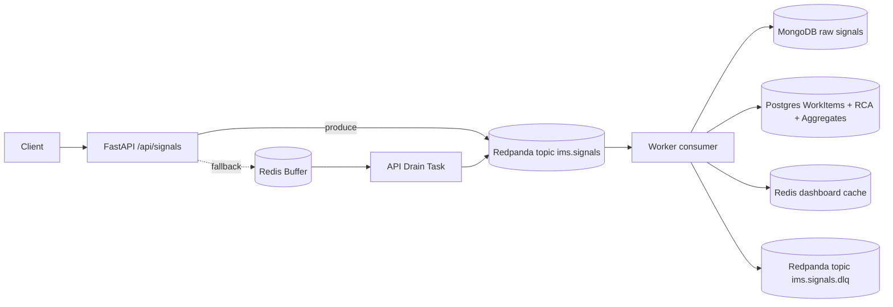

# Incident Management System (IMS)

A production-grade, event-driven engine designed for high-availability ingestion, strict data consistency, and operational resilience.

## 1. System Design & Architecture

### High-Level Architecture


### Design Rationale: "Why this stack?"
- **Kafka (Redpanda)**: Decouples ingestion from processing. It acts as a massive buffer that absorbs traffic bursts, allowing the API to remain thin and non-blocking.
- **Polyglot Persistence**:
    - **PostgreSQL**: Used for transactional consistency. Incident states, RCAs, and audit logs must be ACID-compliant.
    - **MongoDB**: Used as a high-throughput sink for raw signal data. It scales horizontally and handles schema-less payloads better than relational stores.
    - **Redis**: Used for real-time dashboard caching and as a "circuit breaker" fallback buffer when Kafka is unavailable.
- **Debounce Logic**: To prevent "alert storms," the system buffers incoming signals per component. An incident is only created once a threshold (100 signals) is met within a 10s window.
- **Idempotency**: Every signal requires a unique `event_id`. Duplicates are dropped at the MongoDB layer via a unique index, ensuring replayed signals don't corrupt audit logs.

---

## 2. Data Flow
1.  **Signal Ingestion**: Client POSTs a signal to `/api/signals`. The API validates the payload, assigns a UUID `event_id` if missing, and enqueues it to Kafka.
2.  **Backpressure & Buffering**: If the system is under heavy load, signals accumulate in Kafka. The ingestion layer remains stable and fast.
3.  **Worker Processing**: The worker consumes signals in batches, archives them in MongoDB, and increments Redis-based debounce counters.
4.  **Incident Creation**: Once the debounce threshold is hit, the worker creates a `WorkItem` in PostgreSQL using a partial unique index to ensure only one active incident exists per component.
5.  **State Management**: Operators transition incidents (OPEN → INVESTIGATING → RESOLVED → CLOSED). The system enforces a mandatory RCA submission before an incident can be closed.

---

## 3. Failure Handling & Resilience

- **Kafka Outage**: The API implements exponential backoff retries. If the outage persists, it falls back to a Redis memory buffer to ensure zero data loss. An internal task drains the buffer back to Kafka once it recovers.
- **Worker Crash**: Kafka retains the message offset. Upon restart, the worker picks up exactly where it left off.
- **Poison Messages (DLQ)**: Malformed signals or those causing processing errors are shunted to `ims.signals.dlq`. They can be inspected and replayed using `scripts/replay_dlq.py`.

---

## 4. How to Run

### Prerequisites
- Docker & Docker Compose

### Setup
```bash
cp .env.example .env  # Configure your DSNs/URIs if needed
docker compose up --build -d
```

**Exposed Ports:**
- API: `http://localhost:8000`
- Redpanda Console: `http://localhost:8080` (Inspect signals in real-time)

---

## 5. Demo Instructions (Operational Proof)

### A. Burst & Debounce Test
Flood the system with 100+ signals to trigger an incident.
```bash
./scripts/burst_test.sh
```
**Observe**: 
- `/api/metrics` shows a spike in `signals_aggregated_last_hour`.
- Only **one** incident is created in PostgreSQL despite hundreds of signals.

### B. Chaos Test: Worker Failure
Kill the worker while sending load to see Kafka buffer the messages.
```bash
./scripts/kill_worker.sh
```
**Observe**:
- API still returns `202 Accepted`.
- Re-run `docker compose start worker` and watch the worker catch up instantly from the offset.

### C. Chaos Test: Broker Failure
Kill Kafka to trigger the Redis fallback buffer.
```bash
./scripts/kill_kafka.sh
```
**Observe**:
- API remains alive. Logs show: `Kafka send failed, falling back to Redis buffer`.
- RESTORE: `docker compose start redpanda`. Watch the API drain the buffer to Kafka automatically.

### D. Operational DLQ Replay
Inspect and replay failed messages.
```bash
docker compose exec -e PYTHONPATH=/app worker python /app/scripts/replay_dlq.py --max 5 --dry-run
```

---

## 6. Backpressure Management
The system is explicitly designed to handle load spikes without blocking. The **thin ingestion API** ensures that writes to slow storage (Mongo/Postgres) never occur in the request path. By utilizing Kafka as the central nervous system, the throughput of the ingestion layer is decoupled from the latency of the storage layer.

