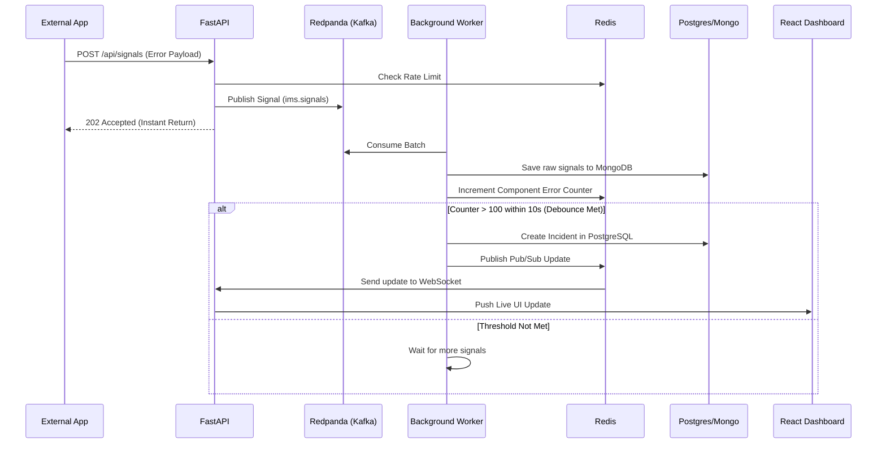

# 🚨 Incident Management System (IMS)

> A high-throughput, fault-tolerant incident processing system with backpressure handling, strict lifecycle enforcement, real-time UI, and strong consistency guarantees across a polyglot persistence layer.

This system is designed to tolerate partial failures and maintain correctness under high-throughput conditions. It acts as a central nervous system for monitoring external applications, automatically converting thousands of error signals into actionable, deduplicated incidents.

---

## 🏗️ System Architecture

The architecture relies heavily on event-driven principles, decoupling fast ingestion from heavy database writes. 

```mermaid
flowchart TD
    subgraph External
        E1[External Apps<br/>e.g. PayEazie] -- "POST /api/signals" --> API
    end

    subgraph "Dockerized Environment (Linode VPS)"
        subgraph Proxy
            CADDY[Caddy Reverse Proxy<br/>Port 80/443 + SSL]
        end

        subgraph "Frontend UI"
            REACT[React + Vite SPA<br/>Nginx]
        end

        subgraph Backend
            API[FastAPI Server<br/>Async Ingestion]
            WORKER[Python Worker<br/>Async Processing]
        end

        subgraph Persistence
            KAFKA[(Redpanda/Kafka)<br/>ims.signals buffer]
            REDIS[(Redis)<br/>Debounce, Rate Limit, Pub/Sub]
            MONGO[(MongoDB)<br/>Raw Telemetry Dump]
            PG[(PostgreSQL)<br/>Incident State & RCA]
        end

        CADDY -- "/*" --> REACT
        CADDY -- "/api/* & /ws/*" --> API
        API -- "Fallback Buffer" --> REDIS
        API -- "Produce (Non-blocking)" --> KAFKA
        WORKER -- "Consume" --> KAFKA
        WORKER -- "Bulk Insert" --> MONGO
        WORKER -- "Check Counters" --> REDIS
        WORKER -- "Create Incident" --> PG
        WORKER -- "Pub/Sub Push" --> REDIS
        REDIS -- "WebSocket Feed" --> API
    end

    API -. "WebSocket Live Updates" .-> REACT
```

---

## ⚙️ Data Flow (Step by Step)

Here is exactly what happens when an external service throws an error:


```mermaid
sequenceDiagram
    participant App as External App
    participant API as FastAPI
    participant Kafka as Redpanda (Kafka)
    participant Worker as Background Worker
    participant Redis as Redis
    participant DB as Postgres/Mongo
    participant UI as React Dashboard

    App->>API: POST /api/signals (Error Payload)
    API->>Redis: Check Rate Limit
    API->>Kafka: Publish Signal (ims.signals)
    API-->>App: 202 Accepted (Instant Return)
    
    Worker->>Kafka: Consume Batch
    Worker->>DB: Save raw signals to MongoDB
    Worker->>Redis: Increment Component Error Counter
    
    alt Counter > 100 within 10s (Debounce Met)
        Worker->>DB: Create Incident in PostgreSQL
        Worker->>Redis: Publish Pub/Sub Update
        Redis->>API: Send update to WebSocket
        API->>UI: Push Live UI Update
    else Threshold Not Met
        Worker->>Worker: Wait for more signals
    end
```

---

## ✨ Features & Capabilities

This system goes beyond baseline requirements in the following ways:

| Feature | Description |
|----------|-------------|
| **Debounce & Deduplication** | `event_id`-based deduplication in MongoDB + DB-level partial unique index in Postgres prevents duplicate incidents. Alert storms collapse N signals into 1 incident. |
| **SLA Breach Auto-Escalation** | Incidents unresolved past the 30m SLA threshold are automatically escalated to P0 (Critical) and logged as `SLA_BREACH` events. |
| **Strict State Machine & RCA** | `OPEN` → `INVESTIGATING` → `RESOLVED` → `CLOSED`. Closing an incident without a Root Cause Analysis (RCA) returns HTTP 400 — enforced at DB level. |
| **Kafka Fallback Buffer** | API continues accepting requests during broker outages via Redis circuit-breaker + async drain task. Zero data loss. |
| **Real-time Web UI** | React/Vite dashboard connects via WebSockets to instantly display state changes and incoming incidents without page reloads. |
| **Production Ready Deployment** | Automated multi-container Docker compose setup behind a Caddy reverse proxy with automatic SSL (HTTPS). |

---

## 🛠️ Why Each Technology Was Chosen

| Component | Technology | Rationale |
|-----------|-----------|-----------|
| **Message Broker** | Kafka (Redpanda) | Absorbs traffic bursts; decouples ingestion latency from storage latency. API stays fast even when DBs are slow or unavailable. |
| **Source of Truth** | PostgreSQL | ACID transactions. Incident state, RCA, and audit trail require strong consistency — not eventual. |
| **Raw Signal Store** | MongoDB | Schema-less, high-write-throughput storage for raw telemetry. Signals arrive in varying shapes. |
| **Cache + Fallback** | Redis | Sub-millisecond reads, real-time Pub/Sub, and sliding window counters. Doubles as a circuit-breaker buffer. |
| **Backend API** | FastAPI | Native async I/O; Pydantic validation; minimal overhead in the hot path. |
| **Frontend SPA** | React + Vite | Component-driven UI with instant state reflections using hooks and WebSockets. |
| **Edge Proxy** | Caddy | Zero-configuration automatic Let's Encrypt SSL certificates. |

---

## 🚀 How to Run & Deploy

### Prerequisites
- Docker ≥ 20.x and Docker Compose ≥ 2.x

### Deployment (Production/Linode)
```bash
# 1. Clone the repository
git clone <repo-url>
cd IMS

# 2. Setup Environment variables
cp .env.example .env

# 3. Build and run all containers in detached mode
docker compose up -d --build
```

Access the application:
- **UI Dashboard**: `https://<your-domain.com>`
- **API Docs**: `https://<your-domain.com>/api/docs`

---

## 🧪 Testing & Failure Simulation

### 1. Burst & Debounce Test
Simulate thousands of errors to verify the debounce logic collapses them into a single incident:
```bash
python scripts/demo_load.py --base-url http://localhost:8000
```

### 2. Lifecycle Enforcement
Try closing an incident without submitting an RCA. The system will reject it.
```bash
INCIDENT_ID=$(curl -sS http://localhost:8000/api/incidents | jq -r '.[0].id')

# Attempt close without RCA — must fail
curl -sS -X POST http://localhost:8000/api/incidents/$INCIDENT_ID/transition \
  -H 'content-type: application/json' -d '{"to_state":"CLOSED"}' | jq '.detail'
# "RCA is missing or incomplete; cannot close incident"
```

### 3. Chaos: Broker Failure (Resilience Test)
```bash
./scripts/simulate_kafka_outage.sh

curl -sS -X POST http://localhost:8000/api/signals \
  -H 'content-type: application/json' \
  -d '{"component_id":"TEST","component_type":"TEST","message":"kafka down"}'
# {"status":"queued","event_id":"..."}  ← 202, buffered to Redis

docker compose start redpanda
# Drain task runs automatically — buffer rehydrates Kafka without data loss!
```
